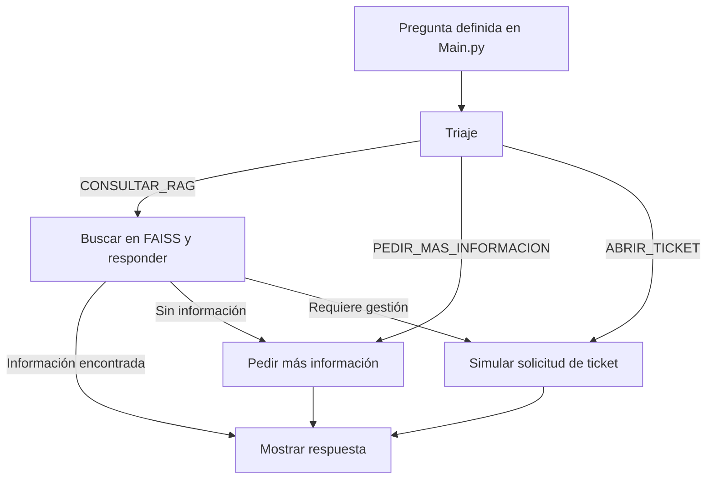

# Prototipo inicial del Agente de Políticas Alicorp

Este repositorio contiene un proyecto educativo para probar el uso de
**LangChain**, **LangGraph** y **RAG** sobre documentos de políticas
corporativas.

> **Importante:** la rama `main` corresponde al prototipo inicial ejecutado
> desde la terminal. La aplicación web con FastAPI, interfaz React y despliegue
> en Render se encuentra en la rama
> [`Api-Agente`](https://github.com/CORREAK18/AgenteIA_Alicorp_Politicas/tree/Api-Agente).

## Objetivo de esta rama

La rama `main` se creó para comprobar que era posible:

- cargar archivos PDF con políticas corporativas;
- dividir los documentos en fragmentos de texto;
- generar embeddings y guardarlos en un índice FAISS;
- clasificar la consulta mediante un triaje;
- dirigir el flujo con LangGraph;
- buscar información relevante con RAG;
- generar una respuesta utilizando un modelo de lenguaje;
- mostrar la respuesta y guardar un diagrama del grafo.

Esta rama sirve como prueba de concepto y como base del desarrollo posterior.
No representa la versión final de la aplicación.

## Funcionamiento general



El flujo comienza en `Main.py`. El triaje analiza la pregunta y decide si debe
consultar los documentos, pedir más información o indicar que se necesita un
ticket.

En este prototipo, la opción de ticket **solo devuelve un mensaje de texto**.
No crea un ticket real ni envía correos electrónicos. Esa funcionalidad se
implementó posteriormente en la rama `Api-Agente`.

## Tecnologías utilizadas

| Tecnología | Uso en el prototipo |
|---|---|
| Python | Lenguaje principal |
| LangChain | Carga de documentos, cadenas y recuperación RAG |
| LangGraph | Control del flujo y sus decisiones |
| FAISS | Almacenamiento y búsqueda de vectores |
| Gemini u Ollama | Modelo de lenguaje y embeddings |
| PyMuPDF | Lectura de los documentos PDF |

## Estructura principal

```text
AgenteIA_Alicorp_Politicas/
├── Documentos/         # Archivos PDF usados por el agente
├── Main.py             # Punto de entrada y pregunta de prueba
├── config.py           # Lectura de variables del archivo .env
├── providers.py        # Configuración de Gemini u Ollama
├── documentos.py       # Carga y división de los documentos
├── triaje.py           # Clasificación inicial de la consulta
├── vectorstore.py      # Índice FAISS y retriever
├── busqueda_rag.py     # Generación de la respuesta con RAG
├── grafo.py            # Flujo creado con LangGraph
├── grafo_agente.png    # Diagrama generado por el prototipo
├── rag.py              # Versión experimental anterior del flujo RAG
└── requirements.txt    # Dependencias de Python
```

Las carpetas `.vscode` y `__pycache__` no forman parte de la lógica del agente:
la primera guarda preferencias locales de Visual Studio Code y la segunda
contiene archivos temporales generados por Python.

## Requisitos para Windows

- Git.
- Python 3.13.2, que fue la versión utilizada durante el desarrollo.
- Una clave de Gemini o una instalación local de Ollama.

Para ejecutar esta rama no se necesita Node.js, Docker, FastAPI ni React.

## Instalación paso a paso en Windows

### 1. Descargar solamente la rama `main`

Abrir PowerShell en la carpeta donde se guardará el proyecto y ejecutar:

```powershell
git clone --branch main --single-branch https://github.com/CORREAK18/AgenteIA_Alicorp_Politicas.git
cd AgenteIA_Alicorp_Politicas
```

Si el repositorio ya está descargado, entrar a su carpeta y seleccionar la
rama:

```powershell
git switch main
```

### 2. Comprobar Python

```powershell
python -V
```

El resultado esperado en el equipo usado para desarrollar el proyecto es:

```text
Python 3.13.2
```

### 3. Crear y activar el entorno virtual

```powershell
python -m venv .venv
Set-ExecutionPolicy -Scope Process -ExecutionPolicy RemoteSigned
.\.venv\Scripts\Activate.ps1
```

Cuando el entorno esté activo, PowerShell mostrará `(.venv)` al inicio de la
línea.

### 4. Instalar las dependencias

```powershell
python -m pip install --upgrade pip
python -m pip install -r requirements.txt
```

### 5. Crear el archivo `.env`

El archivo `.env` contiene la configuración privada y no se publica en GitHub.
Debe crearse manualmente en la raíz del proyecto, al mismo nivel que `Main.py`:

```powershell
notepad .env
```

#### Opción A: usar Gemini

Pegar este contenido y reemplazar el valor de la clave:

```env
LLM_PROVIDER=gemini
EMBEDDINGS_PROVIDER=gemini
GEMINI_API_KEY=TU_CLAVE_DE_GEMINI

PDF_DIR=./Documentos
FAISS_INDEX_DIR=./faiss_index
TAMANO_LOTE_EMBEDDINGS=20
PAUSA_SEGUNDOS_EMBEDDINGS=15
MOSTRAR_MULTIQUERIES=true
```

#### Opción B: usar Ollama localmente

Ollama debe estar instalado y sus modelos deben estar disponibles antes de
ejecutar el proyecto. Luego se puede usar una configuración como esta:

```env
LLM_PROVIDER=ollama
EMBEDDINGS_PROVIDER=ollama
OLLAMA_BASE_URL=http://localhost:11434
OLLAMA_LLM_MODEL=gemma3:4b
OLLAMA_EMBEDDING_MODEL=bge-m3

PDF_DIR=./Documentos
FAISS_INDEX_DIR=./faiss_index
TAMANO_LOTE_EMBEDDINGS=20
PAUSA_SEGUNDOS_EMBEDDINGS=15
MOSTRAR_MULTIQUERIES=true
```

No se deben combinar las dos opciones. Tampoco se debe subir el archivo `.env`
ni publicar sus claves.

### 6. Ejecutar el prototipo

```powershell
python Main.py
```

La primera ejecución puede tardar porque el programa debe leer los PDF,
generar embeddings y crear el índice FAISS. Las siguientes ejecuciones pueden
reutilizar el índice guardado.

Al finalizar, la terminal mostrará la pregunta de prueba y la respuesta del
agente. También se intentará actualizar el archivo `grafo_agente.png`.

## Probar otra pregunta

Esta versión no tiene una interfaz para escribir preguntas. La consulta de
prueba está definida al final de `Main.py`:

```python
pregunta = "Cuales son las politicas de sanciones economicas?"
```

Para probar otra consulta:

1. abrir `Main.py`;
2. cambiar el texto de la variable `pregunta`;
3. guardar el archivo;
4. ejecutar nuevamente `python Main.py`.

Ejemplo:

```python
pregunta = "¿Qué indica la política sobre regalos y atenciones?"
```

## Resultado esperado

Durante la ejecución se mostrarán mensajes relacionados con:

1. el proveedor del modelo y los embeddings;
2. la carga de los documentos PDF;
3. la creación o carga del índice FAISS;
4. la decisión tomada por el triaje;
5. la ruta seguida dentro del grafo;
6. la respuesta final.

## Alcance y limitaciones

La rama `main`:

- funciona desde la terminal;
- ejecuta una sola pregunta definida en el código;
- no incluye una API REST;
- no incluye frontend web;
- no mantiene una conversación con memoria;
- no tiene un verificador adicional de respuestas RAG;
- no crea ni envía tickets reales;
- no está preparada para desplegarse directamente en Render;
- no necesita Docker para ejecutarse localmente.

Estas características sí fueron ampliadas en la rama
[`Api-Agente`](https://github.com/CORREAK18/AgenteIA_Alicorp_Politicas/tree/Api-Agente).

## Seguridad

- No publicar el archivo `.env`.
- No escribir claves de API directamente en los archivos `.py`.
- Si una clave se publica por error, debe revocarse y reemplazarse.

## Estado del proyecto

Este código se conserva como evidencia del primer prototipo y del aprendizaje
inicial con LangChain, LangGraph, FAISS y RAG. El desarrollo funcional continúa
en la rama `Api-Agente`.