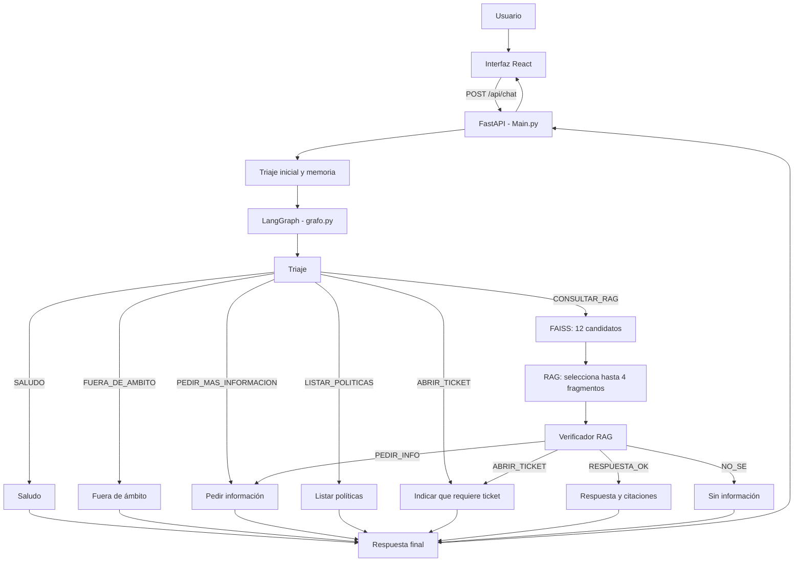
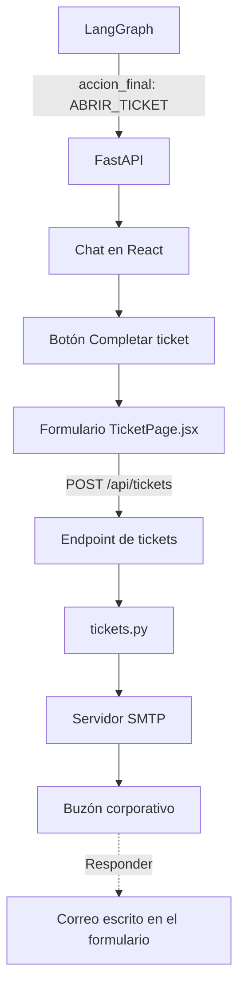

# 🤖 Agente de Políticas Corporativas de Alicorp

Aplicación web con inteligencia artificial que responde consultas sobre las
políticas corporativas de Alicorp. El sistema clasifica cada mensaje, busca
información en documentos PDF mediante RAG, verifica la respuesta y muestra las
fuentes utilizadas.

Cuando una solicitud necesita una gestión real, el agente no envía el ticket
automáticamente. Primero muestra un formulario para que el usuario revise y
complete la información. El correo se envía únicamente después de confirmar el
formulario.

## 🌐 Aplicación desplegada

La aplicación está desplegada en Render:

**https://agente-alicorp.onrender.com**

> Si el servicio se encuentra inactivo, la primera carga puede tardar mientras
> Render lo inicia nuevamente.

## 🌿 Ramas del repositorio

El repositorio conserva el prototipo inicial y la versión web completa.

| Rama | Contenido |
| --- | --- |
| `main` | Prototipo inicial ejecutado desde Python. No contiene API REST, frontend React ni README. |
| `Api-Agente` | Versión completa y actual: FastAPI, React, LangGraph, RAG, memoria, verificación, tickets por correo, Docker y despliegue en Render. |

El proyecto tiene dos ramas: `main` conserva el prototipo y `Api-Agente`
contiene la aplicación web completa.

> La rama utilizada para el desarrollo y despliegue es `Api-Agente`.

## ✨ Funcionalidades principales

- Chat web para consultar las políticas corporativas.
- Clasificación de mensajes mediante un triaje con IA.
- Memoria conversacional de corto plazo por sesión.
- Búsqueda semántica sobre documentos PDF con FAISS.
- Generación de respuestas mediante Cohere o Gemini.
- Verificación de respuestas para reducir información no respaldada.
- Citaciones con fragmento, archivo de origen y número de página.
- Listado directo de todas las políticas disponibles.
- Formulario para revisar y enviar solicitudes que requieren gestión.
- Envío de tickets por correo mediante SMTP.
- API REST documentada automáticamente con FastAPI.
- Suite de 44 casos de prueba para triaje, RAG y memoria.

## 🛠️ Tecnologías

| Capa | Tecnologías |
| --- | --- |
| Frontend | Node.js 22.12.0, React 19, Vite 7, Framer Motion, Lucide React y React Markdown |
| API | Python 3.13.2 en desarrollo local, FastAPI, Uvicorn y Pydantic |
| Orquestación | LangGraph y LangChain |
| Modelos de IA | Cohere o Google Gemini |
| Búsqueda RAG | FAISS, embeddings y recuperación semántica |
| Documentos | PyMuPDF, Transformers y tokenizador de Hugging Face |
| Tickets | SMTP y correo electrónico |
| Despliegue | Docker y Render |

## 🏛️ Arquitectura del sistema

React contiene la interfaz gráfica y FastAPI sirve tanto la API como el
frontend compilado. LangGraph se utiliza para decidir cómo responder una
consulta. El formulario de tickets y el envío del correo funcionan fuera del
grafo porque no necesitan una decisión adicional de la IA.

### Flujo de consultas con IA



El diagrama generado directamente por LangGraph se encuentra en
[`grafo_agente.png`](grafo_agente.png).

### Flujo del formulario de tickets



En este flujo:

1. LangGraph solo decide que la solicitud necesita un ticket.
2. FastAPI devuelve `accion_final: ABRIR_TICKET` al frontend.
3. React muestra el botón **Completar ticket**.
4. El usuario revisa la pregunta y completa sus datos.
5. El formulario llama a `POST /api/tickets`.
6. `tickets.py` envía el mensaje desde la cuenta técnica hacia el buzón
   corporativo.
7. El correo del usuario se coloca como `Reply-To` para que el área responsable
   pueda responderle.

Por lo tanto, el formulario, el endpoint de tickets y SMTP no forman parte del
grafo de LangGraph.

## 🔎 Funcionamiento del RAG

1. El frontend envía la pregunta y el identificador de conversación.
2. El triaje clasifica la intención del mensaje.
3. Si la pregunta depende de mensajes anteriores, la memoria la convierte en
   una consulta autónoma y se vuelve a clasificar.
4. El grafo selecciona la ruta correspondiente.
5. Para una consulta documental, FAISS recupera 12 fragmentos candidatos.
6. `busqueda_rag.py` reordena los candidatos y conserva hasta 4 fragmentos.
7. El LLM genera una respuesta utilizando el contexto recuperado.
8. El verificador comprueba que la respuesta atienda la pregunta y tenga
   respaldo documental.
9. FastAPI devuelve la respuesta, la acción final, el triaje y las citaciones.

Las rutas como saludo, listado de políticas o solicitud de más información no
necesitan consultar FAISS.

## 📂 Estructura del proyecto

```text
Backend/
├── Main.py
├── config.py
├── providers.py
├── triaje.py
├── grafo.py
├── busqueda_rag.py
├── memoria.py
├── documentos.py
├── vectorstore.py
├── tickets.py
├── test_agente_ligero.py
├── reporte_pruebas.md
├── requirements.txt
├── Dockerfile
├── Documentos/
├── faiss_indexv2/
└── frontend/
    ├── src/
    │   ├── App.jsx
    │   ├── TicketPage.jsx
    │   ├── main.jsx
    │   └── styles.css
    ├── public/
    ├── package.json
    ├── package-lock.json
    └── vite.config.js
```

`frontend/dist/` es una carpeta generada por `npm run build`. FastAPI sirve su
contenido cuando la aplicación se ejecuta con `python Main.py`.

## 📄 Archivos importantes

| Archivo o carpeta | Función |
| --- | --- |
| `Main.py` | Inicializa los componentes, define los endpoints y sirve el frontend. |
| `config.py` | Lee la configuración de IA, RAG, documentos y correo. |
| `providers.py` | Construye el LLM y los embeddings de Cohere o Gemini. |
| `triaje.py` | Clasifica la intención, urgencia, datos faltantes y uso del historial. |
| `grafo.py` | Define los nodos, decisiones y rutas de LangGraph. |
| `busqueda_rag.py` | Recupera fragmentos, genera una respuesta y la verifica. |
| `memoria.py` | Guarda el historial corto y condensa preguntas dependientes. |
| `documentos.py` | Lee los PDF y los divide en fragmentos cuando se reconstruye el índice. |
| `vectorstore.py` | Carga, valida o reconstruye el índice FAISS. |
| `tickets.py` | Valida el formulario, genera un código de referencia y envía el correo. |
| `Documentos/` | Contiene las políticas corporativas en PDF. |
| `faiss_indexv2/` | Contiene el índice vectorial y su manifiesto de validación. |
| `frontend/src/App.jsx` | Contiene el chat y consume `/api/chat`. |
| `frontend/src/TicketPage.jsx` | Contiene el formulario y consume `/api/tickets`. |
| `frontend/src/styles.css` | Define los estilos del chat y del formulario. |
| `test_agente_ligero.py` | Ejecuta los 44 casos de prueba. |
| `reporte_pruebas.md` | Guarda el resultado de las pruebas ejecutadas. |
| `Dockerfile` | Compila React y prepara FastAPI para producción. |
| `INSTRUCCIONES_TICKETS.md` *(histórico)* | Documentó inicialmente la instalación y el funcionamiento de los tickets por correo. |

`INSTRUCCIONES_TICKETS.md` fue agregado en el commit `cb115d5`. Posteriormente,
su contenido se integró en este README y el archivo fue retirado en el commit
`c1018e3`. Aunque ya no aparece en la estructura actual, permanece disponible
en el historial de Git.

## ⚙️ Requisitos previos

- Python 3.13.2.
- Node.js 22.12.0 y npm.
- Credenciales válidas para Cohere o Gemini.
- Una cuenta de correo técnico con acceso SMTP para enviar tickets.
- Git, si el proyecto se clonará desde GitHub.

## 🔐 Configuración privada

La aplicación utiliza variables privadas para el proveedor de IA y el envío de
correos. Los valores reales deben guardarse únicamente en el archivo `.env`
local y en **Render > Environment**.

Variables principales de IA:

- `LLM_PROVIDER`
- `COHERE_API_KEY` o `GEMINI_API_KEY`
- `EMBEDDINGS_PROVIDER`
- Modelos y tiempos de espera del proveedor seleccionado

Variables principales de correo:

- `SMTP_HOST`
- `SMTP_PORT`
- `SMTP_USER`
- `SMTP_APP_PASSWORD`
- `TICKET_DESTINO`
- `SMTP_TIMEOUT_SECONDS`

`SMTP_USER` es la cuenta técnica que envía el mensaje. El correo escrito en el
formulario identifica al solicitante y se utiliza como `Reply-To`.

> No se deben subir contraseñas, claves de API ni el archivo `.env` a GitHub.

## 📥 Instalación local

### 1. Obtener la rama completa

```bash
git clone --branch Api-Agente https://github.com/CORREAK18/AgenteIA_Alicorp_Politicas.git
cd AgenteIA_Alicorp_Politicas
```

Si el repositorio ya está clonado:

```bash
git switch Api-Agente
```

### 2. Preparar Python

```bash
python -m venv .venv
```

En Windows PowerShell:

```powershell
.\.venv\Scripts\Activate.ps1
python -m pip install --upgrade pip
pip install -r requirements.txt
```

En Linux o macOS:

```bash
source .venv/bin/activate
python -m pip install --upgrade pip
pip install -r requirements.txt
```

### 3. Compilar el frontend

```bash
cd frontend
npm install
npm run build
cd ..
```

### 4. Iniciar la aplicación

Con las variables privadas ya configuradas:

```bash
python Main.py
```

Direcciones locales:

- Aplicación web: `http://localhost:8000`
- Estado del servicio: `http://localhost:8000/health`
- Swagger: `http://localhost:8000/docs`
- ReDoc: `http://localhost:8000/redoc`

El primer arranque puede tardar. La aplicación valida el índice FAISS y solo
carga PyMuPDF y Transformers si necesita reconstruirlo.

## 💻 Desarrollo del frontend

Para usar la recarga automática, deja el backend ejecutándose en el puerto
`8000` y abre una segunda terminal:

```bash
cd frontend
npm run dev
```

Mientras `npm run dev` esté activo, la versión de desarrollo se abre en
`http://localhost:5173`. Vite redirige `/api` y `/health` hacia FastAPI, que
continúa ejecutándose en el puerto `8000`.

Este modo se utiliza solamente para modificar el frontend con recarga
automática. En la ejecución normal, después de `npm run build` y
`python Main.py`, FastAPI sirve la interfaz directamente en
`http://localhost:8000`; en ese caso no es necesario abrir el puerto `5173`.

Después de modificar el frontend, ejecuta nuevamente `npm run build` si deseas
probarlo directamente desde `python Main.py`.

## 🚀 Uso de la aplicación

### Consulta documental

Ejemplo:

> ¿Qué establece la política corporativa sobre los regalos de proveedores?

El agente buscará información en FAISS, verificará la respuesta y mostrará las
fuentes consultadas.

### Solicitud de ticket

Ejemplo:

> Registra una denuncia porque un proveedor me ofreció dinero. Abre un ticket.

El agente devolverá `ABRIR_TICKET`. La interfaz mostrará el formulario, pero el
correo no se enviará hasta que el usuario presione **Enviar ticket**.

El código mostrado después del envío es un código de referencia incluido en el
correo. No permite consultar estados porque el proyecto no utiliza una base de
datos de tickets.

## 🔌 Endpoints principales

| Método | Ruta | Descripción |
| --- | --- | --- |
| `GET` | `/health` | Indica si el agente terminó de inicializarse. |
| `GET` | `/api/politicas` | Lista las políticas disponibles. |
| `POST` | `/api/triaje` | Clasifica una pregunta sin ejecutar el RAG. |
| `POST` | `/api/chat` | Ejecuta memoria, LangGraph, RAG y verificación. |
| `POST` | `/api/tickets` | Valida el formulario y envía el ticket por correo. |
| `DELETE` | `/api/chat/historial/{thread_id}` | Elimina el historial de una sesión. |

Acciones finales posibles:

- `SALUDO`
- `FUERA_DE_AMBITO`
- `PEDIR_INFO`
- `LISTAR_POLITICAS`
- `AUTO_RESOLVER`
- `SIN_INFORMACION`
- `ABRIR_TICKET`

## 🧪 Pruebas automatizadas

La suite contiene 44 casos de triaje, RAG y memoria. Primero debe iniciarse el
backend:

```bash
python Main.py
```

En una segunda terminal:

```bash
python test_agente_ligero.py
```

Comandos útiles:

```bash
# Solo triaje
python test_agente_ligero.py --grupo triaje

# Solo RAG y memoria
python test_agente_ligero.py --grupo rag

# Casos específicos
python test_agente_ligero.py --desde 1 --hasta 10

# Cambiar el perfil de pausas
python test_agente_ligero.py --modo normal
python test_agente_ligero.py --modo rapido
```

Los modos disponibles son `ligero`, `normal` y `rapido`. El resultado se guarda
en `reporte_pruebas.md` después de cada caso completado.

## 🐳 Docker

Construir la imagen:

```bash
docker build -t agente-alicorp .
```

Ejecutar el contenedor con la configuración privada:

```bash
docker run --env-file .env -p 8000:8000 agente-alicorp
```

El `Dockerfile` utiliza dos etapas: `node:22-alpine` compila el frontend y
`python:3.11-slim` ejecuta FastAPI en la imagen final. Estas son las versiones
del contenedor y no reemplazan las versiones instaladas en el equipo local.

## ☁️ Despliegue en Render

La rama `Api-Agente` está preparada para desplegarse como un servicio Docker.
Render instala las dependencias, compila React y ejecuta `python Main.py`.

La aplicación utiliza la variable `PORT` proporcionada por Render y sirve el
frontend y la API desde el mismo dominio.

Comprobación del servicio:

**https://agente-alicorp.onrender.com/health**

## ⚠️ Consideraciones actuales

- La memoria conversacional se guarda en RAM y se pierde al reiniciar el
  servicio.
- El índice FAISS se reutiliza mientras coincidan los PDF y el modelo de
  embeddings.
- Si cambian los documentos o embeddings, el índice se reconstruye.
- Las pruebas realizan llamadas reales al proveedor de IA y pueden consumir
  cuota.
- Los tickets se envían por correo, pero no se guardan en una base de datos.
- El código del ticket es una referencia para buscar el correo, no un sistema
  de seguimiento de estados.
- No existe autenticación de usuarios ni una mesa de ayuda integrada.
- No se deben ejecutar varias suites intensivas al mismo tiempo contra el mismo
  servicio.