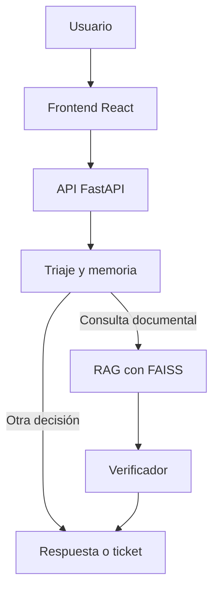

# 🤖 Agente de Políticas Corporativas de Alicorp

Aplicación web con inteligencia artificial que responde consultas sobre las políticas corporativas de Alicorp. El sistema clasifica cada mensaje, busca información en documentos PDF mediante RAG, verifica que la respuesta esté respaldada por las fuentes y devuelve citaciones con el nombre del documento y la página correspondiente.

## 🌐 Aplicación desplegada

La aplicación está desplegada en Render:

**https://agente-alicorp.onrender.com**

> 💡 Si el servicio se encuentra inactivo, la primera carga puede tardar mientras Render lo reactiva.

## ✨ Funcionalidades principales

- 💬 Consulta de políticas corporativas desde una interfaz web.
- 🗂️ Clasificación automática de saludos, consultas fuera de ámbito, solicitudes incompletas, consultas documentales y gestiones que requieren ticket.
- 🔍 Búsqueda semántica sobre documentos PDF mediante FAISS.
- 🧠 Generación de respuestas con Cohere o Gemini.
- 🛡️ Verificación de respuestas para reducir alucinaciones e información no respaldada.
- 📑 Citaciones con fragmento, archivo de origen y número de página.
- 💾 Memoria conversacional de corto plazo separada por `thread_id`.
- 📋 Listado de las políticas disponibles.
- ⚡ API REST documentada automáticamente con FastAPI.
- 🧪 Suite de 44 pruebas automatizadas para triaje, RAG y memoria.

## 🛠️ Tecnologías

| Capa | Tecnologías |
| --- | --- |
| **Backend** | Python 3.11, FastAPI, Uvicorn, Pydantic |
| **Orquestación** | LangGraph y LangChain |
| **Modelos de IA** | Cohere o Google Gemini |
| **Búsqueda RAG** | FAISS, embeddings y recuperación semántica |
| **Procesamiento** | PyMuPDF, Transformers y tokenizador Hugging Face |
| **Frontend** | React 19, Vite 7, Framer Motion, Lucide React, React Markdown |
| **Despliegue** | Docker y Render |

## 🏛️ Arquitectura

La solución se ejecuta como una sola aplicación. React genera el frontend estático y FastAPI lo sirve junto con la API REST.



Flujo de una consulta documental:

1. FastAPI recibe la pregunta y el identificador de sesión.
2. El triaje clasifica la intención y determina la ruta apropiada.
3. Si el mensaje depende de una conversación anterior, la memoria lo convierte en una consulta autónoma.
4. FAISS recupera 12 fragmentos candidatos y el módulo RAG selecciona hasta 4 documentos relevantes.
5. El LLM genera una respuesta utilizando únicamente el contexto recuperado.
6. Un verificador comprueba que la respuesta atienda la pregunta y esté respaldada.
7. La API devuelve la respuesta, la acción final, los datos del triaje y las citaciones.

El diagrama completo del grafo también está disponible en [`grafo_agente.png`](grafo_agente.png).

## 📂 Estructura del proyecto

```text
Backend/
├── Main.py
├── config.py
├── providers.py
├── triaje.py
├── grafo.py
├── busqueda_rag.py
├── memoria.py
├── documentos.py
├── vectorstore.py
├── test_agente_ligero.py
├── reporte_pruebas.md
├── requirements.txt
├── Dockerfile
├── Documentos/
├── faiss_indexv2/
└── frontend/
    ├── src/
    ├── public/
    ├── package.json
    └── vite.config.js
```

## 📄 Archivos importantes

| Archivo o carpeta | Función |
| --- | --- |
| `Main.py` | Punto de entrada. Inicializa el agente, define los endpoints y sirve el frontend compilado. |
| `config.py` | Centraliza la configuración de proveedores, modelos, documentos, índice y fragmentación. |
| `providers.py` | Construye el LLM y el modelo de embeddings de Cohere o Gemini. |
| `triaje.py` | Clasifica la consulta y determina intención, urgencia, datos faltantes y uso del historial. |
| `grafo.py` | Define con LangGraph las rutas del agente y sus acciones finales. |
| `busqueda_rag.py` | Recupera fragmentos, genera respuestas y verifica su respaldo documental. |
| `memoria.py` | Mantiene el historial corto por sesión y condensa preguntas dependientes del contexto. |
| `documentos.py` | Carga los PDF y los divide en fragmentos medidos en tokens. |
| `vectorstore.py` | Carga, valida o reconstruye el índice FAISS. |
| `Documentos/` | Contiene las políticas corporativas en formato PDF. |
| `faiss_indexv2/` | Guarda el índice vectorial y su manifiesto de validación. |
| `frontend/src/` | Contiene la interfaz React, sus estilos y la lógica de consumo de la API. |
| `test_agente_ligero.py` | Ejecuta la suite automatizada con control de pausas y límites. |
| `reporte_pruebas.md` | Reporte generado y actualizado durante la ejecución de las pruebas. |
| `Dockerfile` | Compila React y prepara la aplicación FastAPI para producción. |

## ⚙️ Requisitos previos

- Python 3.11.
- Node.js 22 y npm.
- Una cuenta y credenciales válidas para Cohere o Gemini.
- Git, si el proyecto será clonado desde un repositorio.

## 🔐 Configuración privada

El proyecto necesita variables de entorno privadas para conectarse al proveedor de IA. Deben configurarse localmente antes de iniciar la aplicación.

⚠️ *Por seguridad, este README no incluye, reproduce ni documenta valores privados. No se deben subir credenciales al repositorio, incluirlas en capturas ni compartirlas en archivos comprimidos. El archivo que las contiene debe permanecer ignorado por Git.*

## 📥 Instalación local

### 1. Preparar el backend

Desde la carpeta raíz `Backend`:

```bash
python -m venv .venv
```

Activar el entorno virtual en Windows PowerShell:

```powershell
.\.venv\Scripts\Activate.ps1
```

En Linux o macOS:

```bash
source .venv/bin/activate
```

Instalar las dependencias:

```bash
python -m pip install --upgrade pip
pip install -r requirements.txt
```

### 2. Preparar el frontend

```bash
cd frontend
npm install
npm run build
cd ..
```

El comando `npm run build` crea `frontend/dist`, que posteriormente es servido por FastAPI.

### 3. Iniciar la aplicación

Con la configuración privada ya disponible en el entorno local:

```bash
python Main.py
```

La aplicación quedará disponible en:

- Interfaz web: `http://localhost:8000`
- Estado de la API: `http://localhost:8000/health`
- Swagger: `http://localhost:8000/docs`
- ReDoc: `http://localhost:8000/redoc`

El arranque puede tardar la primera vez. El sistema comprueba el índice FAISS y lo reconstruye si los documentos o el modelo de embeddings cambiaron.

## 💻 Desarrollo del frontend

Para trabajar con recarga automática, mantener el backend activo en el puerto `8000` y ejecutar en otra terminal:

```bash
cd frontend
npm run dev
```

Vite abrirá la interfaz en `http://localhost:5173` y redirigirá `/api` y `/health` hacia FastAPI.

## 🚀 Uso de la aplicación

### Desde la interfaz web

1. Abrir la aplicación local o el enlace desplegado en Render.
2. Escribir una consulta relacionada con las políticas corporativas.
3. Revisar la respuesta y las fuentes mostradas por el agente.
4. Mantener el mismo `thread_id` permite continuar una conversación desde la API; la interfaz administra su propia sesión.

Ejemplo de consulta:

> ¿Qué establece la política corporativa sobre los regalos de proveedores?

### Desde la API

Enviar una pregunta al agente:

```bash
curl -X POST "http://localhost:8000/api/chat" \
  -H "Content-Type: application/json" \
  -d '{"pregunta":"¿Puedo recibir dinero de un proveedor?","thread_id":"usuario-001"}'
```

El cuerpo acepta:

| Campo | Tipo | Descripción |
| --- | --- | --- |
| `pregunta` | `string` | Consulta que se enviará al agente. |
| `thread_id` | `string` | Identificador de sesión. Si se omite, se utiliza `default`. |

La respuesta incluye `respuesta`, `accion_final`, información de `triaje` y una lista de `citaciones` cuando intervino el RAG.

## 🔌 Endpoints principales

| Método | Ruta | Descripción |
| --- | --- | --- |
| `GET` | `/health` | Indica si el agente terminó de inicializarse. |
| `GET` | `/api/politicas` | Lista las políticas disponibles. |
| `POST` | `/api/triaje` | Clasifica una consulta sin ejecutar el RAG. |
| `POST` | `/api/chat` | Ejecuta el flujo completo del agente. |
| `DELETE` | `/api/chat/historial/{thread_id}` | Elimina el historial de una sesión. |

Acciones finales posibles: `SALUDO`, `FUERA_DE_AMBITO`, `PEDIR_INFO`, `ABRIR_TICKET`, `LISTAR_POLITICAS`, `AUTO_RESOLVER` y `SIN_INFORMACION`.

## 🧪 Pruebas automatizadas

La suite contiene 44 casos de triaje, recuperación RAG y memoria conversacional. Las pruebas se ejecutan contra `http://localhost:8000`, por lo que el backend debe estar activo y `/health` debe responder `{"status":"ok"}`.

En una primera terminal:

```bash
python Main.py
```

En una segunda terminal, desde la raíz del proyecto:

```bash
python test_agente_ligero.py
```

Comandos útiles:

```bash
# Solo pruebas rápidas de clasificación
python test_agente_ligero.py --grupo triaje

# Solo pruebas que utilizan RAG
python test_agente_ligero.py --grupo rag

# Ejecutar un rango específico de casos
python test_agente_ligero.py --desde 1 --hasta 10

# Cambiar el perfil de pausas
python test_agente_ligero.py --modo normal
python test_agente_ligero.py --modo rapido

# Sobrescribir el tiempo máximo por solicitud
python test_agente_ligero.py --timeout 420
```

Perfiles disponibles:

| Modo | Característica |
| --- | --- |
| `ligero` | Predeterminado. Usa pausas amplias para reducir carga y respetar límites de la API. |
| `normal` | Equilibra duración y consumo de recursos. |
| `rapido` | Reduce las pausas; se recomienda únicamente cuando el proveedor y el equipo soportan la carga. |

También pueden ajustarse `--pausa`, `--descanso-cada`, `--descanso` y `--extra-rag`. El script guarda los resultados después de cada caso en `reporte_pruebas.md`, por lo que conserva un reporte parcial incluso si se interrumpe con `Ctrl+C`.

## 🐳 Ejecución con Docker

Construir la imagen:

```bash
docker build -t agente-alicorp .
```

Iniciar el contenedor proporcionando las variables privadas en tiempo de ejecución:

```bash
docker run --env-file .env -p 8000:8000 agente-alicorp
```

El `Dockerfile` utiliza una compilación en dos etapas: Node.js genera el frontend y Python ejecuta FastAPI en el contenedor final.

## ☁️ Despliegue en Render

El proyecto está preparado para desplegarse mediante Docker. Render construye la imagen, instala las dependencias, compila React y ejecuta `python Main.py`. La aplicación usa la variable `PORT` proporcionada por la plataforma y sirve tanto el frontend como la API desde el mismo dominio.

Después de un despliegue se puede comprobar el estado en:

**https://agente-alicorp.onrender.com/health**

## ⚠️ Consideraciones

- La memoria conversacional se almacena en RAM y se pierde cuando el proceso se reinicia.
- El índice FAISS se reutiliza mientras coincidan los documentos y el proveedor/modelo de embeddings.
- Si se agregan o modifican PDF, el índice puede reconstruirse durante el siguiente arranque.
- Las pruebas realizan llamadas reales al proveedor de IA y pueden consumir cuota.
- Los tickets se representan como una acción del agente; este proyecto no incluye una integración externa con una mesa de ayuda.
- No se deben ejecutar varias suites intensivas simultáneamente contra el mismo servicio.
